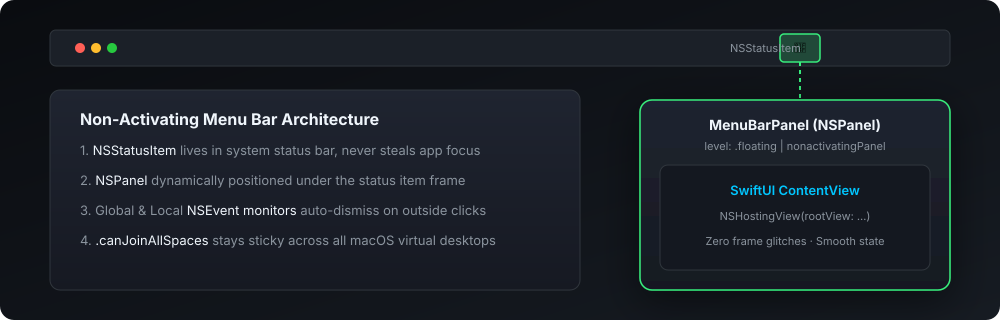

# menubar-swiftui-template 

A production-ready starter architecture for building high-performance macOS menu bar extra apps using **SwiftUI**, **NSPanel** floating popovers, and Swift Concurrency.

[](https://github.com/nilkanthdesai76/menubar-swiftui-template/actions)
[](https://swift.org)
[](https://developer.apple.com/macos)
[](https://swift.org/package-manager/)
[](LICENSE)

<p align="center">
  
</p>

---

## Why this Architecture?

Standard SwiftUI `MenuBarExtra` is great for simple utility menus, but quickly falls short for rich interactive apps:
- ❌ **Cannot anchor a custom `NSPanel`** with custom corner radius, blur material, or vibrancy.
- ❌ **Steals key application focus** or drops active fullscreen game/editor sessions.
- ❌ **Cannot position floating windows precisely** beneath the status icon.

### Our Solution
1. **`NSStatusItem`** manages the menu bar icon with zero UI flicker.
2. **`MenuBarPanel` (`NSPanel`)** provides a `.nonactivatingPanel` overlay with `level = .floating`.
3. **`NSHostingView`** renders any native SwiftUI `View` with full animation support.
4. **Dual `NSEvent` Monitors** track global clicks outside the panel to gracefully dismiss it.

---

## Project Structure

```
Sources/MenuBarApp/
├── main.swift                 # @MainActor application lifecycle entry point
├── MenuBarController.swift    # Status item manager, coordinate anchoring & outside-click dismiss
├── MenuBarPanel.swift         # Borderless NSPanel configured with .canJoinAllSpaces & .floating
└── ContentView.swift          # Custom SwiftUI interface
```

---

## Build & Run

```bash
git clone https://github.com/nilkanthdesai76/menubar-swiftui-template.git
cd menubar-swiftui-template
swift run
```

---

## License

This project is licensed under the MIT License - see the [LICENSE](LICENSE) file for details.
